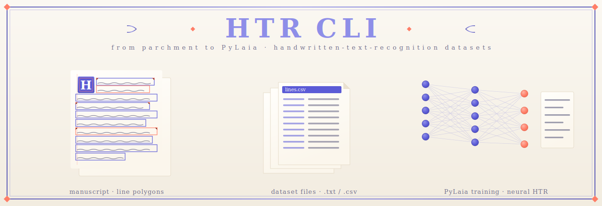

<p align="center">
  
</p>

<p align="center">
  <a href="https://pypi.org/project/htr-cli/"></a>
  <a href="https://github.com/ndrscalia/htr-cli/actions/workflows/test.yml"></a>
  <a href="https://github.com/ndrscalia/htr-cli/blob/main/LICENSE"></a>
</p>

<h1 align="center">
    CLI for preparing HTR datasets
    </h1>

This CLI tool offers a quick way to (optionally) pull PAGE-XML data from Transkribus[^1] and to prepare perfectly valid `dataset/` directory ready for feeding PyLaia.

If you find any value in this project please leave a star and consider to offer me a coffee (Paypal or Github sponsor).

## Installation

```bash
uv tool install htr-cli
# or
pipx install htr-cli
# or
pip install htr-cli
```

Verify the install:
```bash
htr-cli --help
```

`pull-transkribus` depends on [transkribus-client](https://pypi.org/project/transkribus-client/), which pins `lxml==4.6.3` (no wheels for Python 3.11+ on most platforms). Until that pin is relaxed upstream, you need to override it at install time. `uv` is the only package manager that supports this cleanly.

```bash
echo "lxml>=5.0" > overrides.txt
uv tool install --override overrides.txt 'htr-cli[transkribus]'
```


For devs:
```bash
git clone https://github.com/ndrscalia/htr-cli.git
cd htr-cli
uv sync --all-extras # override already wired in pyproject.toml
```

Run the test suite:
```bash
uv run pytest
uv run ruff check
```

## Usage
The CLI exposes the following sub-commands (in pipeline order):

```bash
init
scaffold
data-extraction
split-dataset
process-images
process-images-tfe
```

### init
Interactive setup. If used, asks for Transkribus email and password and sores them in your OS keyring under the service name `htr-cli`.

### scaffold
Creates the directory layout the rest of the pipeline expects:
```bash
.
└── root/
    ├── dataset/
    │   ├── images/
    │   │   ├── train
    │   │   ├── val
    │   │   └── test
    │   └── pyalaia's stuff and more
    └── data/
        ├── images
        └── xml_texts
```

### pull-transkribus
Downloads GT pages from Transkribus (default). For every collection, walks documents and pages, filtering by `--page-status`, and writes each page's image do `data/images/` and its PAGE-XML counterpart to `data/xml_tests/`.
Naming pattern: `{collection}_{docId}_{pageId}_{imageId}_{filename}.{jpg,xml}`.
This subcommand relies on [transkribus-client](https://pypi.org/project/transkribus-client/), which in turn relies on legacy API that might be discontinued soon.
Install with the optional [transkribus] extra (see the installation section above).

### data-extraction
Parses every XML found in `data/xml_texts/` and emits the intermediate dataset files:

- `polygons_coordinates.json`: per-line polygon coordinates for later cropping.
- `lines.csv`: one row per line: page, region id, region order, reading order, line id, raw text, "unclear" flag.
- `dataset/syms.txt`: PyLaia's CTC symbol vocabulary.
- `dataset/{tokens,lexicon_characters,dictionary}.txt`: different files for KenLM model creation and further post-processing (coming soon).

Optional positional argument filters by region type and `--unclear-name` sets the custom-tag name that skips the line. E.g.:

```bash
htr-cli data-extraction paragraph --unclear-name "unclear"
```

NBSP chars are normalize to plain space.

### split-dataset
Reads `lines.csv` and partitions by **page** (not line) using a deterministic random_state. The following options are available:
- `--val-size`: validation set size (default to 10%);
- `--test-size`: test set size (default to 0%);
- `--omit-unclear / -u`: omit lines where an "unclear" tag appears.

If you only want validation set, skip passing `--test-size`.

To supply your own page-level split instead of the random one, pass `--custom-train` / `--custom-val` / `--custom-test`, each pointing at a text file with one id per line. Files accept either bare page names or full line ids, so the `dataset/{train,val,test}_ids.txt` files this command writes can be fed back in to reproduce a previous split. `--custom-test` is optional (omit it for a train+val split). When any custom flag is set, `--val-size` and `--test-size` are ignored.

This subcommand write the following files:
- `dataset/{train,val,test}_ids.txt`
- `dataset/{train,val,test}.txt`
- `dataset/{train,val,test}_text.txt`
- `dataset/corpus_characters.txt` (corpus for char KenLM training)
- `missing_reading_order.csv` (lines dropped if no reading order available)

### process-images
The pure-Python preprocessing pipeline. For each entry in polygons_coordinates.json: loads the source image, masks out everything outside the polygon, crops to the polygon's bounding box, converts to grayscale, then runs the selected pipeline:
- `--full-pipeline` (default): contrast stretch - modified Sauvola - deslope - deslant (TFE port) - moment-normalize.
- `--light-pipeline`: deslope - deslant (vendored DeslantImg) - modified Sauvola.

Each stage is individually toggleable (`--no-contrast-stretch`, `--no-enhance-sauvola`, etc.).
Final image is resized to `norm_height` (positional arg, default 64 px) preserving aspect ratio, padded 10 px left/right with white, and written to `dataset/images/{train,val,test}/` based on which split the line belongs to.

At the beginning of every run, `dataset/images_processing_ckpt.txt` is written and allows to interrupt and resume processing. If you want to abort processing the images and start from scratch, you have to delete that file.

### process-images-tfe
Same as `process-image`, but uses [TextFeatExtractor](https://github.com/omni-us/pagexml) C++ library and the default parameters are based on Transkribus' params:

```python
tfe = TextFeatExtractor(
    stretch=True,
    enh=True,
    enh_win=30,
    enh_prm=0.1,
    enh3_prm0=0,
    enh3_prm2=0,
    deslope=True,
    deslant=True,
    normxheight=0,
    normheight=64,
    momentnorm=True,
    fcontour_dilate=0,
    padding=10,
    maxwidth=6000,
  )
```

This subcommand requires `textfeat` + `pagexml` Python bindings, which are not on PyPi and will only run on Linux (see the `Dockerfile.tfe` section below).

Use this if you want the C++ behavior, and `process-images` when you want a pure-Python install that works on macOS or outside Docker in general.

Differences in performances have not been compared extensively with my simpler implementation, but the two commands take more or less the same time to run and both mess up some images.

To get further help:
```bash
htr-cli --help
htr-cli COMMAND --help
```

## Dockerfile.tfe
This is needed to run `htr-cli image-proessing-tfe` if you are not on Linux.

Build the docker image (one-time, from the repo root):

```bash
docker build -t textfeatextractor .
```

To run the docker image that allows you to use `TextFeatExtractor`, mount the entire project directory into the container so the `htr-cli` package, `data/`, and `dataset/` are all visible inside:

```bash
docker run -it -v "$(pwd)":/workspace -w /workspace textfeatextractor bash
```

- `-v "$(pwd)":/workspace` bind-mounts the repo root at `/workspace`. Use an absolute path (e.g. `/Users/andreascalia/code/my_project`) instead of `$(pwd)` if you're invoking the command from outside the project.
- `-w /workspace` sets the working directory so relative paths like `data/`, `dataset/`, and `polygons_coordinates.json` resolve the way the CLI expects.

The Dockerfile only installs the C++ deps (`pagexml`, `textfeat`); install the CLI as explained at the beginning of these docs.

## Future Updates
- Further post-processing options to get better CER and WER.
- Standard configs file to easier PyLaia's use.
- ALTO XML format support.
- [Kraken](https://github.com/mittagessen/kraken) support.


[^1]:   This feature relies on legacy API. It might not work anymore in
        the near future.
